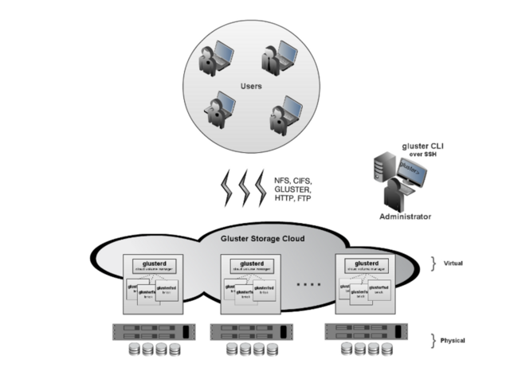

Introducing Gluster File System
===============================

GlusterFS is an open source, clustered file system capable of scaling to
several petabytes and handling thousands of clients. GlusterFS can be
flexibly combined with commodity physical, virtual, and cloud resources
to deliver highly available and performant enterprise storage at a
fraction of the cost of traditional solutions.

GlusterFS clusters together storage building blocks over Infiniband RDMA
and/or TCP/IP interconnect, aggregating disk and memory resources and
managing data in a single global namespace. GlusterFS is based on a
stackable user space design, delivering exceptional performance for
diverse workloads.

GlusterFS is designed for today's high-performance, virtualized cloud
environments. Unlike traditional data centers, cloud environments
require multi-tenancy along with the ability to grow or shrink resources
on demand. Enterprises can scale capacity, performance, and availability
on demand, with no vendor lock-in, across on-premise, public cloud, and
hybrid environments.

GlusterFS is in production at thousands of enterprises spanning media,
healthcare, government, education, web 2.0, and financial services. The
following table lists the commercial offerings:

* [Red Hat Storage](https://access.redhat.com/site/documentation/Red_Hat_Storage/)
* Red Hat Storage Software Appliance
* Red Hat Virtual Storage Appliance
